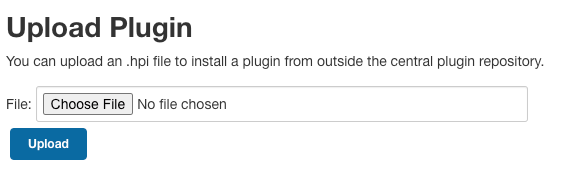
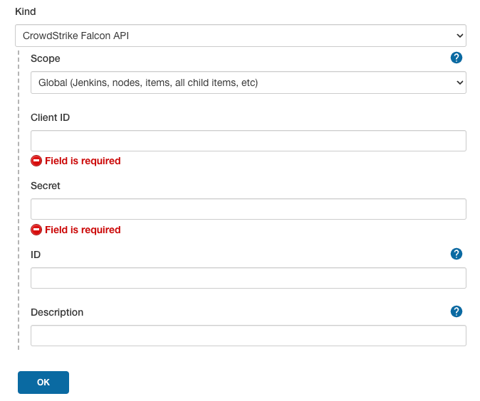
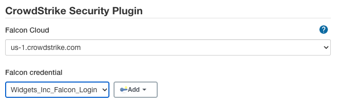
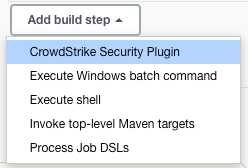
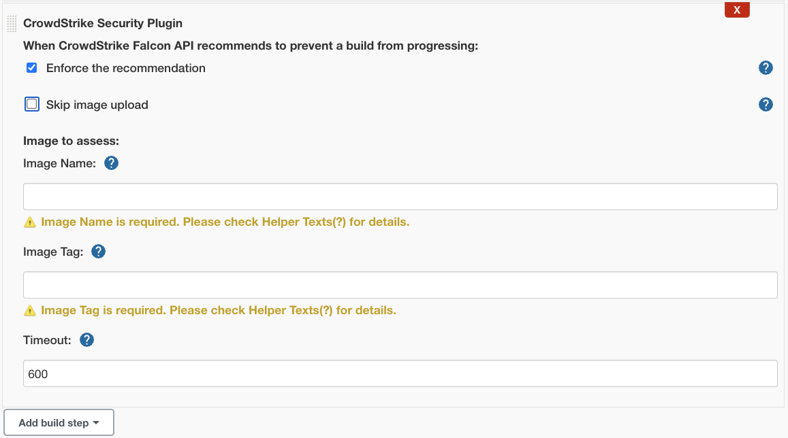
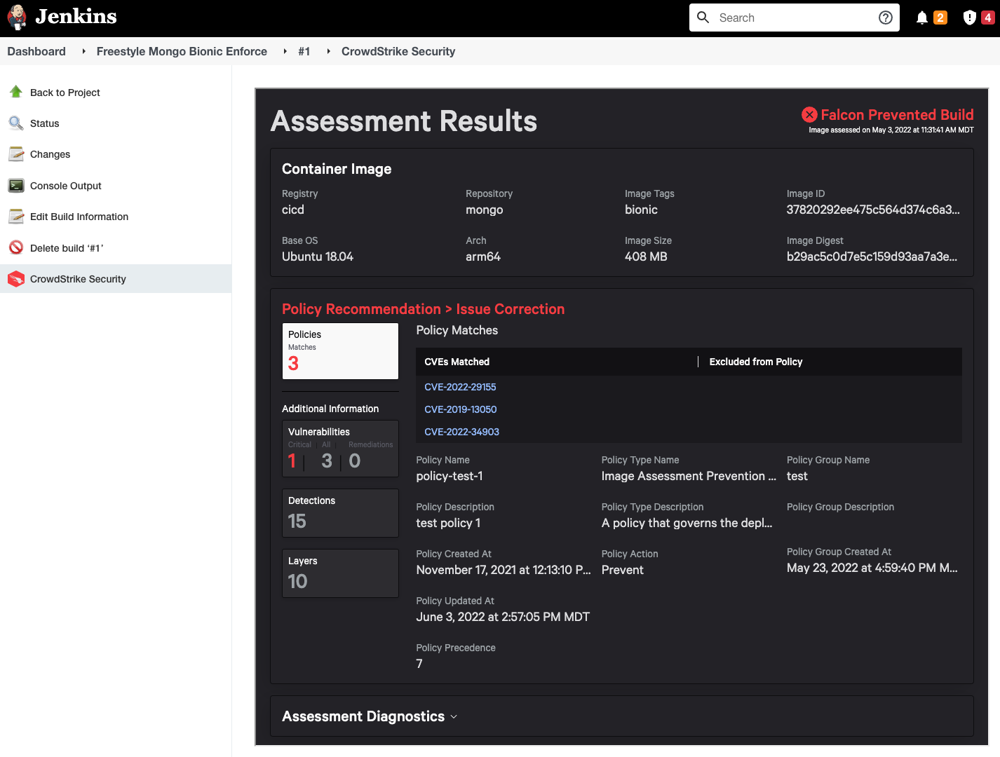

# CrowdStrike Security for Jenkins

## About the plugin

* It is best practice to catch issues as early as possible in the development cycle since it both improves security and decreases the workload for both developers and security.
* In order to do this, CrowdStrike is offering solutions for developers at build time that allow them to assess their Docker container images and review summarized report data integrated with their favorite CI/CD tools like Jenkins.
* Customers will use this feature by downloading from Falcon console, and following Falcon documentation to install our plugins on top of their existing self-hosted CI/CD solutions.
* Customers will then generate a new authentication token within Falcon console, and configure their plugin to use this credential for communication with existing Falcon APIs.
* Users of this plugin receive a unique HTML view of the Image Assessment report data embedded inside Jenkins. 
* Users of this plugin can choose to use the information Falcon provides to actively abort the deployment of vulnerable container images as an in-line step in the build pipeline.

## About the Image Assessment feature

**Image Assessment** is focused on identifying vulnerabilities in container images.   
This plugin is leveraging that existing feature of Falcon via the Falcon API.

For more information about CrowdStrike's Image Assessment feature:
  * Login to Falcon console.
  * Open `Dashboard > Kubernetes and Security > Image Assessment` documentation.

## Installing the plugin

### Requirements:
- Java >= 8
- Jenkins >= 2.319.1
- Docker Engine + CLI (any version)
- Must have a paid subscription to CrowdStrike Falcon
  - Your `CID` should have:
    - `Product Bundle`: `Cloud Workload Protection (CWP)`
    - `SKU`: `Falcon Container Image Scanning`
  - Your `CID` > `User` should have:
    - `Role`: `Falcon Container Image Admin`
  - Your API `ClientID` should have:
    - `Scope`: `Falcon Container Image` both `READ` + `WRITE`

### 1. Install plugin & restart Jenkins

- Download the latest stable release version of this plugin from Falcon console.
    * `Falcon console > Support > Tool Downloads`  
    * Click to download `CrowdStrike Security for Jenkins` file archive.
    * Extract the `.zip` archive locally.
    * Look for the `.hpi` file which is the format of a Jenkins plugin.
- Upload the plugin to Jenkins
    * In Jenkins, navigate to `Manage Jenkins > Manage plugins`.
    * Click on the `advanced` tab.
    * Click `Choose File` and select the `.hpi` file you extracted from archive, earlier



- Click `Deploy`

- Additional resources to [Installing a new plugin in Jenkins](https://jenkins.io/doc/book/managing/plugins/#installing-a-plugin).

### 2. Configure CrowdStrike Security plugin settings globally

These settings are used for authenticating Jenkins plugin to Falcon services.
You can fill them in manually, or use the automatic configuration option (ie. if you have a large fleet of Jenkins servers).

- Generate the token to enable communication with Falcon API by Jenkins.
    * Login to Falcon console.
    * If you have defined more than one Customer ID (`CID`), it's important to choose the one with appropriate permissions from top-right navigation drop-down menu in Falcon console, before proceeding.
    * Visit `Falcon console > Support > API Clients & Keys`
    * Select `Falcon Container Image` permission with `READ` and `WRITE` access checked.
    * Click `Add` button to finish creating your credentials.
    * On the following screen you will be given `Client ID` and `Secret` values. Copy these to your clipboard.

### Manual configuration

#### Set up credentials
- In Jenkins, navigate to `Manage Jenkins > Manage Credentials > System > Global Credentials > Add Credentials`
    * Select `CrowdStrike Falcon API` as Kind and fill out required information
      

- In Jenkins, navigate to `Manage Jenkins > Configure System > CrowdStrike Security`,
    * Select the `Credential ID` (generated above).
    * Select a `Falcon Cloud` from the dropdown menu. 
    * Click the `Save` button.

#### Q: What is the Falcon Cloud?

It represents the server where a) your Customer ID (CID) has a subscription, b) where you generated the `Client ID` and `Secret` credentials (where they are active/accepted), c) where this plugin will push your Docker container images to for assessment, and d) where this plugin will pull the Image Assessment reports from. The table below shows which cloud the user selection will correspond with.

| Falcon Cloud (User Selection)  |  Cloud Env | Type | Falcon API Domain | Falcon Registry Domain | Access |
|---|---|------|------|------|--------|
| us-1.crowdstrike.com  | Beta (CSA)  |  Production |   api.crowdstrike.com |   container-upload.us-1.crowdstrike.com |  Public |
|  us-2.crowdstrike.com | Maverick  |   Production |   api.us-2.crowdstrike.com   |   container-upload.us-2.crowdstrike.com   |   Public |
| eu-1.crowdstrike.com  | Lion  |  Production |  api.eu-1.crowdstrike.com    |  container-upload.eu-1.crowdstrike.com    |   Public |
| us-gov-1.crowdstrike.com  | Eagle  |  Production |  api.laggar.gcw.crowdstrike.com    |   container-upload.laggar.gcw.crowdstrike.com   | DoD IL4 |
| us-gov-2.crowdstrike.com  | Merlin  | Production  |   api.us-gov-2.crowdstrike.com   |   container-upload.us-gov-2.crowdstrike.com   | DoD IL5 |

#### Q: What is Client ID and CID?
* Subscribing customers will have a Customer ID (CID).
* A single CID can create many ClientIDs.
* Each ClientID should have minimum permission set needed to do a task (ie. so if someone stole the credential from Jenkins, they would only be able to upload images for assessment)



### Automatic configuration (alternative)

Jenkins administrators in an enterprise environment would most likely rather use
[Jenkins Configuration as Code (JCasC)](https://www.jenkins.io/projects/jcasc/) which imports configuration from YAML files.
We offer compatibility with this plugin.

#### JCasC Prerequisites

- Install `Configuration as Code` Plugin on your Jenkins instance.

#### JCasC YAML Configuration
To configure your Vault in Jenkins add the following to `jenkins.yaml`:

```yaml
unclassified:
  crowdStrikeSecurity:
    falconCloud: "FALCON CLOUD"
    falconCredentialId: "Falcon_Credential_Id"

credentials:
  system:
    domainCredentials:
      - credentials:
          - credentialsDefault:
              description: "Falcon Token"
              clientID: "${CLIENT_ID}"
              id: "falconToken"
              scope: GLOBAL
              secret: "${SECRET_TOKEN}"
```
See [handling secrets section](https://github.com/jenkinsci/configuration-as-code-plugin/blob/master/docs/features/secrets.adoc) in JCasC documentation to see how to handle sensitive information.

If you are unsure how your yaml file should look like, you can still use the UI to configure credentials.
After you configured Credentials and global configurations
you can use the export feature build into JCasC by visiting `<jenkins-domain>/configuration-as-code/viewExport`

#### JCasC Job DSL

To use a [Job DSL plugin](https://plugins.jenkins.io/job-dsl/) script with JCasC, add the following to the `jenkins.yaml`:

```yaml
jobs:
  - script: >
      pipelineJob('CrowdStrikeSecurity-Pipeline') {
        definition {
          cps {
            script('''
              pipeline {
                  agent any
                  stages {
                      stage('Stage 1') {
                          steps {
                              withCredentials([usernameColonPassword(credentialsId: 'INTEGRATION_ID', variable: '')]) {
                                  crowdStrikeSecurity imageName: 'mongo', imageTag: 'bionic', enforce: true, timeout: 60
                              }
                          }
                      }
                  }
              }
            '''.stripIndent())
            sandbox()
          }
        }
      }
  - script: >
      job('CrowdStrikeSecurity-Freestyle') {
          steps {
              crowdStrikeSecurity() {
                  enforce(true)
                  imageName('mongo')
                  imageTag('bionic')
                  timeout(60)
              }
          }
      }
```

### 3. Configure each of your jobs

Depending on the type of jobs you have.

#### Option A: Freestyle job configuration

These settings must be specified for each Jenkins job, where the plugin is intended to be used to assess container images.

- In Jenkins, navigate to `New Item > Freestyle project`.
- Fill the necessary details, and click on `Add build step` under `Build` section.
- Select `CrowdStrike Security Plugin`.



- Enter the following details:
    * For `When image does not comply with policy`, choose one:
      * `Never fail builds` means Jenkins will ignore instructions from Falcon to block the build.  
         (You will still receive an Image Assessment report.)
      * `Perform action defined in our policy` means if Falcon policy is set to prevent, Jenkins will **enforce** this by failing the build.
    * Image to assess:
        * `Image Name`; name of the docker image to `docker push`
        * `Image Tag`; tag of the docker image to `docker push`
        * `Timeout`; how to long to wait (in seconds) before failing build, if unable to communicate with Falcon API.

**NOTICE:** Plugin assumes `docker` binary is installed and in `$PATH`, and that it is already configured to connect to a running Docker Engine, where images will be pulled-to/pushed-from.  
**NOTICE:** You may use environment `$VARIABLES` in the field values above. (e.g., if Docker image tag is incrementing per-build)



- Click "Save"

#### Option B: Scripted Pipeline job configuration

- In Jenkins, navigate to `New Item > Pipeline`.
- Fill the necessary details, and add your script to the Pipeline definition.
```text
pipeline {
    agent any

    stages {
        stage('Stage 1') {
            steps {
                withCredentials([usernameColonPassword(credentialsId: 'Falcon_Token', variable: '')]) {
                    crowdStrikeSecurity imageName: 'mongo', imageTag: 'bionic', enforce: true, timeout: 60
                }
            }
        }
    }
}
```
- Additional [Pipeline](https://www.jenkins.io/doc/book/pipeline/) information

### 4. Pull the CrowdStrike Security assessment report for a job

Schedule the job to run normally, and the report will be stored among the job output as a set of artifact files.

- Inside the project, click on `Build Now`.
- Under the `Build history` section on the left bar, the user would be able to click on the build to see the `Image Assessment` output.
- The report data is viewable in HTML displaying the details such as Build Blocked, Actions Needed, Vulnerabilities found, etc. if the build is successful.
- Additional troubleshooting details from stdout/stderr are available in `Console Output`.



## Troubleshooting

Symptom | Possible cause | Solution
-|-|-
| <li>Falcon API unresponsive, or responding with failure.<br><br><li>Authentication failure.<br><br><li>`502 Bad Gateway`<br><br><li>Code `-1001`<li>Code `-1002`<li>Code `-1004`<li>Code `-1005`<li>Code `-1006`<li>Code `-1010` | <li>Client ID and/or Secret are invalid.<br><br><li>CID lacks active subscription, appropriate Role, or SKUs.<br><br><li>Selected Falcon Cloud region is incorrectly matched to ClientID, Secret, and CID.<br><br><li>Bearer token expired. | <li>Check that CID is subscribed to **Cloud Workload Protection (CWP)**.<br><br><li>Check that CID has been assigned the **Image Assessment role**.<br><br><li>Check that ClientID and Secret exist within the configured **CID** and **Cloud** region.<br><br><li>Check that ClientID has **Falcon Container Image** both **READ** and **WRITE** permissions.<br><br><li>Check that ClientID and Secret are copy/pasted to Jenkins configuration correctly.<br><br><li>Check that the report is returning within 30 minutes.
| <li>Docker failure.<br><br><li>Code `-1002`<li>Code `-1004`  |  <li>`docker` binary is not found.<br><br><li>Docker Engine service is not running.<br><br><li>Container `image:tag` name is not loaded into Docker Engine. | <li>Check that `docker` **CLI binary** is installed and included in the OS environment PATH variable, in scope for Jenkins build scripts and shell execution contexts.<br><br><li>Check that the **Docker Engine** service is running, and correctly configured and accessible from the `docker` CLI client binary.<br><br><li>Check that your build job will perform `docker pull` or `docker build` before the **CrowdStrike Security** build step begins, so that the container image is already loaded into the Docker Engine.
| <li>`docker tag` failure.<br><br><li>Code `-1003`   | <li>Container image and/or tag are invalid.  | <li>Check the **Image Name** and **Image Tag** input on the job build step configuration.<br><br><li>If using Jenkins environment `$VARIABLE` syntax, ensure variable is predefined and in scope.
| <li>Report failure<br><br><li>`404 Not Found`  |<li>Report not ready. | <li>Increase timeout.

### Error Codes

Code | Name | Description
-|-|-
| -1001 | **AUTHENTICATION_FAILURE** | User authentication failed.
| -1002 | **DOCKER_LOGIN_FAILURE** | Docker login has failed
| -1003 | **DOCKER_TAG_FAILURE** | Error in performing docker tag
| -1004 | **DOCKER_PUSH_FAILURE** | Error in performing docker push
| -1005 | **FETCH_ASSESSMENT_REPORT_FAILURE** | Error in fetching the CrowdStrike Security assessment report
| -1006 | **FETCH_POLICY_REPORT_FAILURE** | Error in fetching the CrowdStrike Security policy report
| -1007 | **PREVENT_BUILD_DUE_TO_POLICY** | CrowdStrike Security prevented the build due to the Falcon Policy. Please deselect `Enforce the recommendation` option in the per-build configuration if you do not want CrowdStrike Security to prevent this build.
| -1008| **PREVENT_BUILD_RECOMMENDATION** | CrowdStrike Security recommends to prevent the build as per the Falcon Policy. Please select `Enforce the recommendation` option in the per-build configuration if you want CrowdStrike Security to enforce the policy.
| -1009 | **HTML_GENERATION_FAILURE** | Failed to generate HTML report
| -1010 | **BUILD_TIMED_OUT** | Build Step Timed-out. Try increasing the value in timeout field in the per-build configuration
| -1011| **INTERNAL_ERROR** | CrowdStrike Security plugin faced an unknown internal error.

### Image

If you want to double-check the vulnerabilities that are found in an existing container image,
you can use the following tool. 

#### CrowdStrike IVAN (Image Vulnerability Analysis):

This tool is a command-line container image assessment tool that 
looks for vulnerabilities in the Docker images.
It unpacks the image locally, and uploads ONLY METADATA to Falcon, which then returns any known vulnerabilities.

The main disadvantage of using IVAN is it can only use its local disk to
check for installed package vulnerabilities. Compared to the approach taken
by this Jenkins plugin, and the Python script below, where the image layers are uploaded to Falcon,
which can then perform more in-depth assessment on the server side, yielding additional more detailed
data in the assessment report including detections for malware, application vulnerabilities, secret strings, etc.

- https://github.com/crowdstrike/ivan

### Policy

If you suspect the image is fine but you want to make your Image Assessment Policy more/less strict,
you will need to do that via the Falcon console. Talk to your Security Administrator if you do not have access,
and give them the Policy Name shown in the Image Assessment report data.

### Plugin

If you suspect the plugin is the problem, you can try this alternative which is a command-line
tool. It still talks to Falcon API, and the assessment happens remotely, but it doesn't require Jenkins 
or this plugin.

Alternatively, you can use the exit code of this script to pass/fail your Jenkins builds.

#### CrowdStrike Container Image Scan

This Python script will upload your container image to Falcon API 
and return the Image Assessment report data as JSON to stdout.
You can also use the exit code to determine pass/fail of Image Assessment Policy.

- https://github.com/CrowdStrike/container-image-scan

## Obtaining Support

* Paying customers may contact CrowdStrike Support team regarding:
  * HOWTO plugin installation
  * Troubleshooting plugin failure (NOT image vulnerability!)
  * Troubleshooting Falcon API response
  * Configuring Image Assessment Policy  